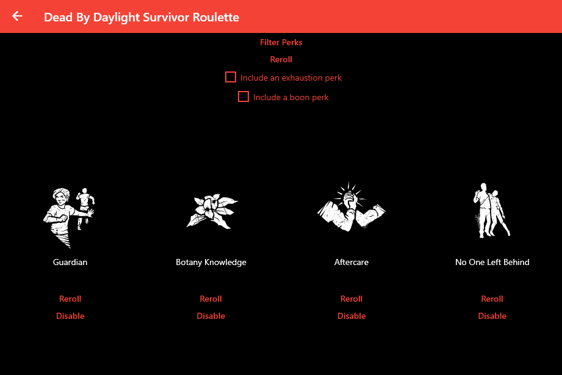
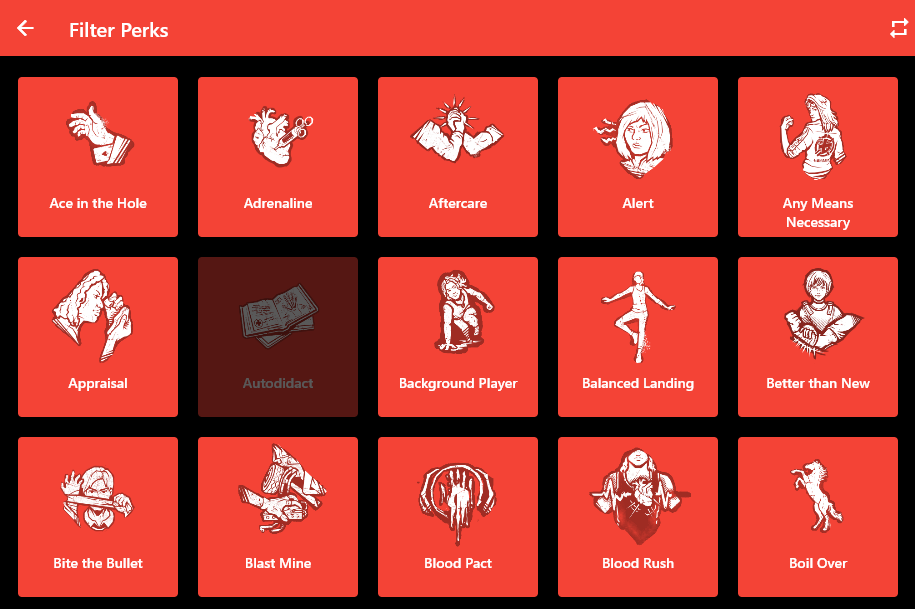
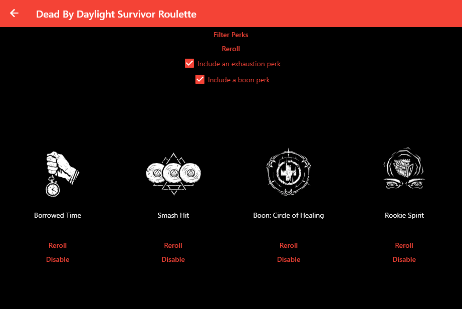
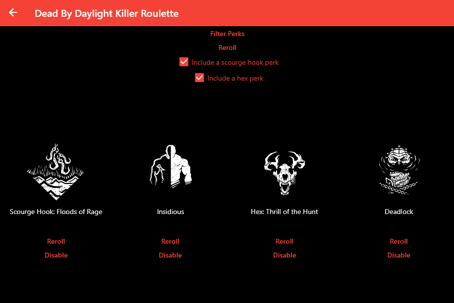

# Dead by Daylight Perk Picker

An app to randomly pick perks to spice up your builds or provide more of a challenge!

## Basic Usage

After picking a role (survivor is shown below) a default perk selection will be presented.

Below is an explanation of the buttons:
* At the top of the window filter perks allows you to disable any perks you want, so they never show
up in the rotation again. 
* Reroll rerolls all the perks.
* If include an exhaustion perk is checked at least one perk that interacts with the exhaustion
status will be included. This includes perks that only work if not exhausted (like _Made for This_)
or cause the exhaustion status (like _Sprint Burst_).
* If include a boon perk is selected at least one boon perk will be included.

Under all perks is another set of buttons:
* Reroll will reroll that single perk.
* Disable will reroll and disable the current perk (so it will not show up as a random perk again).

Below is an example of the perk filter screen, with the lighter icons indicating they are enabled
and the darker icons indicating they are disabled. The top right button will turn all perks on or
off again, as indicated when hovering over the button.

Below is an example with the checkboxes checked and requirements satisfied (the exhaustion perk
_Smash Hit_ and the boon perk _Boon: Circle of Healing_).

The killer perk selection is similar, just instead of exhaustion and boon perks there are scourge 
hooks and hexes. 

